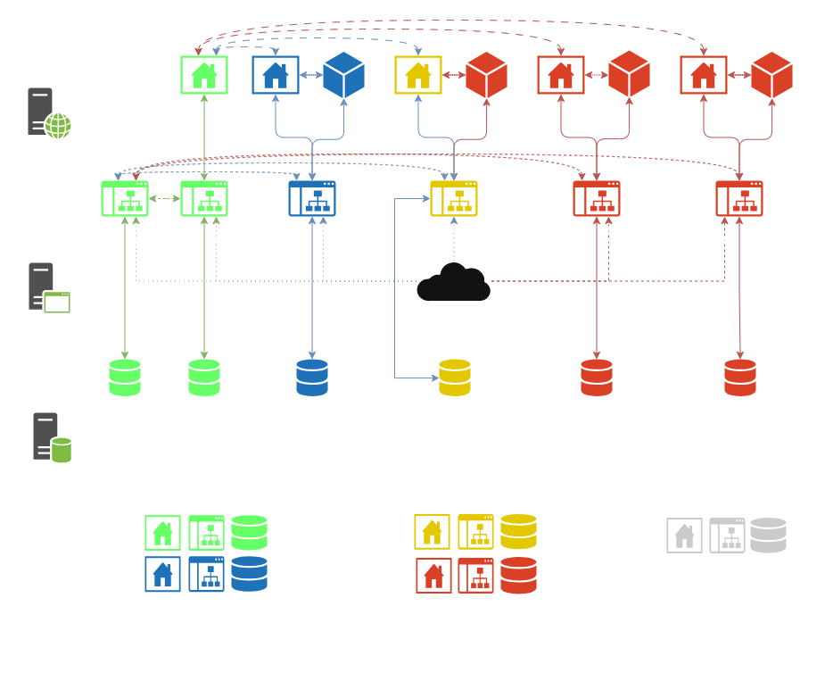

# 🌌 Andromeda

## 🧾 About

**Andromeda** is a microservices-based platform designed as a local, single-player, browser-accessible game service.  
The system runs on a **Raspberry Pi 5** (8GB RAM model) with **Debian 12** installed and is built for the **ARM architecture**.

The platform includes services developed in multiple languages:

- **Java** — using Spring Boot, Hibernate, or raw JDBC
- **JavaScript** — using the React library
- **Python** — using the Django framework

---

## ⚙️ System Components

- **MariaDB 10.11.11**  
  Relational database engine used for data persistence.

- **Apache Tomcat 10**  
  Hosts and manages Java-based microservices (mainly Java 21).

- **Apache HTTP Server**  
  Serves static content and provides access to subpages for the end user.

---

## 🧩 Microservice Ecosystem

Each microservice is located in its own dedicated directory, which contains:

- Source code
- Functional overview and capabilities
- Database schema and structure
- Communication interfaces (e.g., REST endpoints, tokens, etc.)

### List of Applications and databases with current status:

Legend:

| Status          | Description                                                                                      |
|-----------------|--------------------------------------------------------------------------------------------------|
| 🟩 **Released** | App is ready to use and deployed. Source code or public repository exist.                        |
| 🟦 **Beta**     | App is in an early stage, might be on production but needs updates. Source code might be enable. |
| 🟨 **WIP**      | App is under development in private repository.                                                  |
| 🟥 **To-Do**    | App is planned.                                                                                  |

***
#### [Element Apps]

| 🧩 Name                                                                                                       | 🧷 Type         | 🛠️ Version | 📦 Status       | 📝 Short Description                                                                                         |
|--------------------|--------------|---------|--------------|------------------------------------------------------------------|
| [Element Web App]  | Frontend App | 0.1.0   | 🟨 **WIP**   | Web application providing a user interface for Element services. |
| [Element Game App] | Game App     | 0.0.0   | 🟥 **To-Do** | Custom trading card game application.                            |
| [Element Rest Api] | Server App   | 0.1.0   | 🟨 **WIP**   | REST API for managing and distributing Element game data.        |
| [Element Database] | Schema       | 0.1.0   | 🟨 **WIP**   | Database schema for production and testing purposes.             |

***
#### [Chess Apps](https://github.com/szymonderleta/andromeda/tree/main/apps/chess)

| 🧩 Name                                                                                          | 🧷 Type      | 🛠️ Version | 📦 Status       | 📝 Short Description                                         |
|--------------------------------------------------------------------------------------------------|--------------|-------------|-----------------|--------------------------------------------------------------|
| [Chess Web App]                                                                                  | Frontend App | 0.5.0       | 🟦 **Beta**     | Chess webpage providing a user interface                     |
| [Chess Game App]                                                                                 | Game App     | 0.5.0       | 🟦 **Beta**     | Chess game application allowing users to play chess          |
| [Chess Rest API](https://github.com/szymonderleta/andromeda/tree/main/apps/chess/chess-rest-api) | Server App   | 3.0.0       | 🟩 **Released** | REST API for managing chess data and distributing it to apps |
| [Chess Database](https://github.com/szymonderleta/andromeda/tree/main/database/chess)            | Schema       | 2.0.0       | 🟩 **Released** | Database schema for production and testing                   |

***
#### [Nebula Apps ](https://github.com/szymonderleta/andromeda/tree/main/apps/nebula)

| 🧩 Name                                                                                               | 🧷 Type         | 🛠️ Version | 📦 Status       | 📝 Description                                                                          |
|-------------------------------------------------------------------------------------------------------|-----------------|-------------|-----------------|-----------------------------------------------------------------------------------------|
| [Nebula Front App](https://github.com/szymonderleta/andromeda/tree/main/apps/nebula/nebula-front-app) | Frontend App    | 3.0.0       | 🟩 **Released** | Web homepage for login, redirection to services, and user settings management.          |
| [Nebula Rest API](https://github.com/szymonderleta/andromeda/tree/main/apps/nebula/nebula-rest-api)   | Server App      | 3.1.1       | 🟩 **Released** | REST API between Andromeda Auth and services. Manages reading/writing of user settings. |
| [Nebula Database](https://github.com/szymonderleta/andromeda/tree/main/database/nebula)               | Database Schema | 1.0.0       | 🟩 **Released** | Schema used for production and testing environments.                                    |

***
#### [Andromeda Apps](https://github.com/szymonderleta/andromeda/tree/main/apps/andromeda)

| 🧩 Name                                                                                                       | 🧷 Type         | 🛠️ Version | 📦 Status       | 📝 Short Description                                                                                         |
|---------------------------------------------------------------------------------------------------------------|-----------------|-------------|-----------------|--------------------------------------------------------------------------------------------------------------|
| [Andromeda Auth](https://github.com/szymonderleta/andromeda/tree/main/apps/andromeda/andromeda-auth-server)   | Server App      | 3.1.3       | 🟩 **Released** | Handles authorization, authentication, token distribution, mail sending, and management of user credentials. |
| [Andromeda Cloud](https://github.com/szymonderleta/andromeda/tree/main/apps/andromeda/andromeda-cloud-server) | Server App      | 1.1.4       | 🟩 **Released** | Distributes configuration data to other applications.                                                        |
| [Andromeda Database](https://github.com/szymonderleta/andromeda/tree/main/database/andromeda)                 | Database Schema | 1.2.0       | 🟩 **Released** | Database schema used for production and testing environments.                                                |

### Services Logic Layers

  
Image was last updated: 10.05.2025

## 📄 License

**Andromeda** is an open-source project licensed under the [Apache License 2.0](https://www.apache.org/licenses/LICENSE-2.0).
