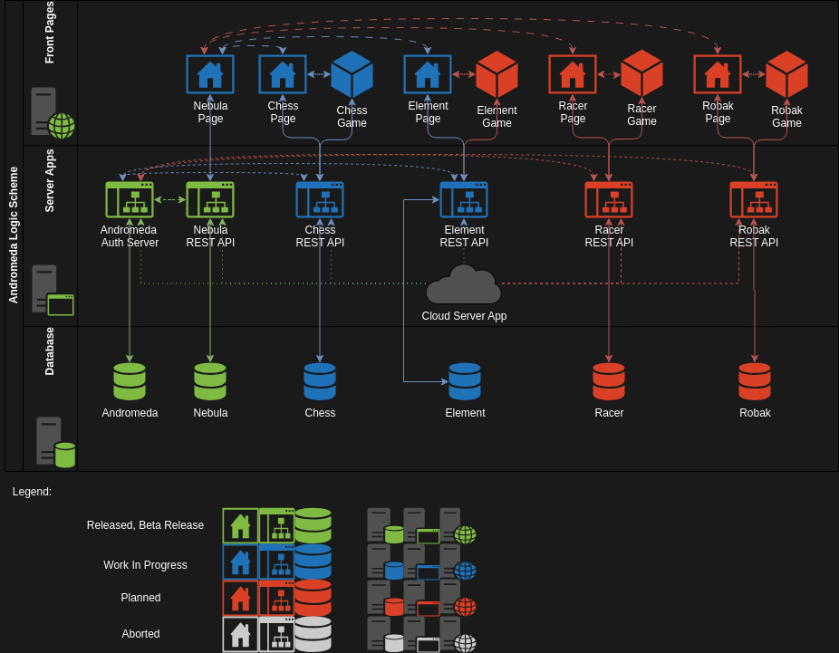

# Andromeda

## About
Andromeda is a microservices-based platform serving as local single-player, browser-accessible game service. The system is built using a Raspberry Pi 5 computer (8GB RAM model) with installed Debian 12 operating system. Therefore, it is based on the arm architecture. The applications were developed in several programming languages including:

- **Java, using the Spring and Hibernate libraries or only JDBC driver**
- **JavaScript, using the REACT library**
- **Python, using the Django library**

### The system is composed of the following services-components:

- **MariaDB 10.11.6 - relational database system**
- **Apache Tomcat 10 server for managing microservices written in Java (mainly version 21)**
- **Apache HTTP Server providing a set of subpages for the end user**

### Microservice ecosystem:

Each application and microservice has its dedicated directory containing source code, description of abilities, functions, database schema and means of communication.

### List of Applications and databases with current status:

Legend:

| Status          | Description                                                                                      |
|-----------------|--------------------------------------------------------------------------------------------------|
| 🟩 **Released** | App is ready to use and deployed. Source code or public repository exist.                        |
| 🟪 **Beta**     | App is in an early stage, might be on production but needs updates. Source code might be enable. |
| 🟦 **WIP**      | App is under development in private repository.                                                  |
| 🟥 **To-Do**    | App is planned.                                                                                  |

***
#### [Element Apps](https://github.com/szymonderleta/andromeda/tree/main/apps/element)

| Name                                                                                      | Type         | Version | Status       | Short Description                                                |
|-------------------------------------------------------------------------------------------|--------------|---------|--------------|------------------------------------------------------------------|
| [Element Web App](https://github.com/szymonderleta/andromeda/tree/main/apps/element)      | Frontend App | 0.0.0   | 🟦 **WIP**   | Web application providing a user interface for Element services. |
| [Element Game App](https://github.com/szymonderleta/andromeda/tree/main/apps/element)     | Game App     | 0.0.0   | 🟥 **To-Do** | Custom trading card game application.                            |
| [Element Rest Api](https://github.com/szymonderleta/andromeda/tree/main/apps/element)     | Server App   | 0.0.0   | 🟦 **WIP**   | REST API for managing and distributing Element game data.        |
| [Element Database](https://github.com/szymonderleta/andromeda/tree/main/database/element) | Schema       | 0.0.0   | 🟦 **WIP**   | Database schema for production and testing purposes.             |

***
#### [Chess Apps](https://github.com/szymonderleta/andromeda/tree/main/apps/chess)

| Name                                                                                  | Type         | Version | Status     | Short Description                                            |
|---------------------------------------------------------------------------------------|--------------|---------|------------|--------------------------------------------------------------|
| [Chess Web App](https://github.com/szymonderleta/andromeda/tree/main/apps/chess)      | Frontend App | 0.0.0   | 🟦 **WIP** | Chess webpage providing a user interface                     |
| [Chess Game App](https://github.com/szymonderleta/andromeda/tree/main/apps/chess)     | Game App     | 0.0.0   | 🟦 **WIP** | Chess game application allowing users to play chess          |
| [Chess Rest API](https://github.com/szymonderleta/andromeda/tree/main/apps/chess)     | Server App   | 1.4.0   | 🟦 **WIP** | REST API for managing chess data and distributing it to apps |
| [Chess Database](https://github.com/szymonderleta/andromeda/tree/main/database/chess) | Schema       | 1.0.0   | 🟦 **WIP** | Database schema for production and testing                   |

***
#### [Nebula Apps ](https://github.com/szymonderleta/andromeda/tree/main/apps/nebula)

| Name                                                                                                | Type         | Version | Status      | Short Description                                                                                      |
|-----------------------------------------------------------------------------------------------------|--------------|---------|-------------|--------------------------------------------------------------------------------------------------------|
| [Nebula Web App](https://github.com/szymonderleta/andromeda/tree/main/apps/nebula/nebula-web-app)   | Frontend App | 1.0.0   | 🟦 **WIP**  | Web home page used for login and redirection to other services. Allows users to update settings.       |
| [Nebula Rest API](https://github.com/szymonderleta/andromeda/tree/main/apps/nebula/nebula-rest-api) | Server App   | 2.0.10  | 🟪 **Beta** | REST API intermediary between Andromeda Auth and other services. Handles reading and writing settings. |
| [Nebula Database](https://github.com/szymonderleta/andromeda/tree/main/database/nebula)             | Schema       | 1.0.0   | 🟪 **Beta** | Database schema used for production and testing.                                                       |

***

#### [Andromeda Apps](https://github.com/szymonderleta/andromeda/tree/main/apps/andromeda)

| Name                                                                                                          | Type       | Version | Status          | Short Description                                                                                                   |
|---------------------------------------------------------------------------------------------------------------|------------|---------|-----------------|---------------------------------------------------------------------------------------------------------------------|
| [Andromeda Auth](https://github.com/szymonderleta/andromeda/tree/main/apps/andromeda/andromeda-auth-server)   | Server App | 3.0.0   | 🟩 **Released** | Used for authorization, authentication, token distribution, mail sending, creation and updating of user credentials |
| [Andromeda Cloud](https://github.com/szymonderleta/andromeda/tree/main/apps/andromeda/andromeda-cloud-server) | Server App | 1.1.4   | 🟩 **Released** | Used to distribute configuration to other apps                                                                      |
| [Andromeda Database](https://github.com/szymonderleta/andromeda/tree/main/database/andromeda)                 | Schema     | 1.2.0   | 🟪 **Beta**     | Schema for production and testing                                                                                   |

### Services Logic Layers

   
Last updated: 29.01.2025

## Licence
Andromeda is an open-source project based on the Apache 2.0 license
