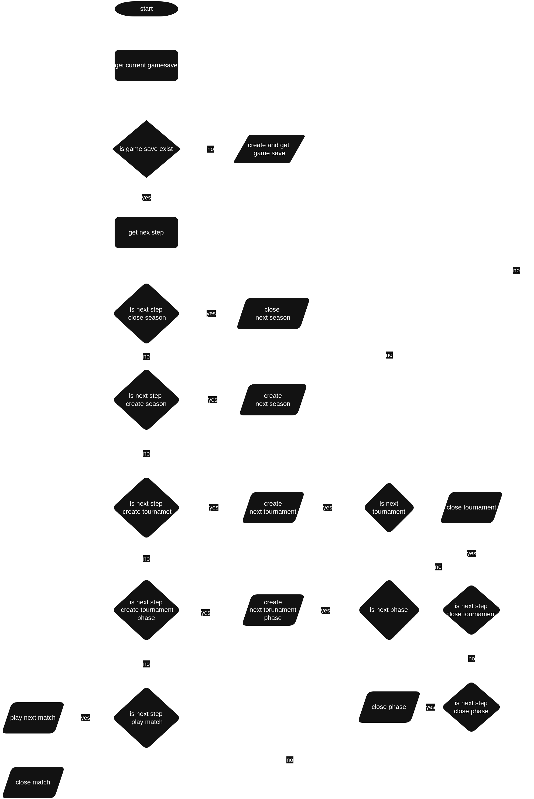

# Apps Project

## About the Apps
This folder contains all Chess family applications related to the [Andromeda Project]. Each application serves a specific purpose and works together to deliver the desired functionality of the project.

## Folder Structure
Work in progress

## Technologies Used
- **Backend applications**: [Java (Spring, Hibernate ORM)]
- **Frontend applications**: [JavaScript (React), Python (Django)]
- **Communication**: REST API.

## API Endpoints Overview

The following table provides a complete list of available API endpoints for the `FrontApp` and `GameApp` modules.  
Each row describes the HTTP method, path, associated controller, and flags indicating whether the endpoint supports pagination, sorting, returns a collection, or is publicly accessible.

> **Note:**
> - `Pageable` indicates whether the endpoint supports pagination.
> - `Sortable` indicates whether the response can be sorted via query parameters.
> - `Collection` means the response returns a list (array) of items.
> - `Public` specifies if the endpoint is publicly accessible without authentication.

---

| App      | Name                          | Endpoint                                  | Controller              | Method                                              | Pageable                                               | Sortable                                               | Collection                                             | Auth Required                                          |
|----------|-------------------------------|-------------------------------------------|-------------------------|-----------------------------------------------------|--------------------------------------------------------|--------------------------------------------------------|--------------------------------------------------------|--------------------------------------------------------|
| FrontApp | GameSave – Get Current        | /game-save/current                        | *GameSaveController*    |        |  |  |  |  |
| FrontApp | GameSave – Get List           | /game-save/list                           | *GameSaveController*    |        |  |  |  |  |
| FrontApp | GameSave – Load by ID         | /game-save?id=game-save-id                | *GameSaveController*    |        |  |  |  |  |
| FrontApp | GameSave – Change Current     | /game-save/current?gameSaveId=uuid        | *GameSaveController*    |      |  |  |  |  |
| FrontApp | GameSave – Create             | /game-save                                | *GameSaveController*    |     |  |  |  |  |
| FrontApp | GameSave – Delete             | /game-save                                | *GameSaveController*    |   |  |  |  |  |
| FrontApp | Next Step – General           | /next-step                                | *NextStepController*    |        |  |  |  |  |
| FrontApp | Next Step – Game              | /next-step/game                           | *NextStepController*    |        |  |  |  |  |
| FrontApp | Next Step – Tournament (GET)  | /next-step/tournament                     | *NextStepController*    |        |  |  |  |  |
| FrontApp | Next Step – Tournament (POST) | /next-step/tournament                     | *NextStepController*    |     |  |  |  |  |
| FrontApp | Next Step – Season (GET)      | /next-step/season                         | *NextStepController*    |        |  |  |  |  |
| FrontApp | Next Step – Season (POST)     | /next-step/season                         | *NextStepController*    |     |  |  |  |  |
| FrontApp | Calendar – Current Month      | /calendar/current                         | *CalendarController*    |        |  |  |  |  |
| FrontApp | Calendar – Target Month       | /calendar?month=12&year                   | *CalendarController*    |        |  |  |  |  |
| FrontApp | Tournament – Season List      | /tournament/list/current                  | *TournamentController*  |        |  |  |  |  |
| FrontApp | Tournament – Current          | /tournament/current                       | *TournamentController*  |        |  |  |  |  |
| FrontApp | Tournament – Phases           | /tournament/phases?tournamentId=1         | *TournamentController*  |        |  |  |  |  |
| FrontApp | Tournament – Groups           | /tournament/groups?tournamentId=1&phase=2 | *TournamentController*  |        |  |  |  |  |
| FrontApp | Ranking – Global              | /ranking/global                           | *RankingController*     |        |  |  |  |  |
| FrontApp | Ranking – List                | /ranking/list                             | *RankingController*     |        |  |  |  |  |
| FrontApp | Ranking – Target by ID        | /ranking?id=2025                          | *RankingController*     |        |  |  |  |  |
| FrontApp | Award – Current               | /award/current                            | *AwardController*       |        |  |  |  |  |
| FrontApp | Award – List                  | /award/list                               | *AwardController*       |        |  |  |  |  |
| FrontApp | Award – Target by ID          | /award?id=2025                            | *AwardController*       |        |  |  |  |  |
| FrontApp | Trophy – List                 | /trophy                                   | *TrophyController*      |        |  |  |  |  |
| FrontApp | Game History – List           | /game/history/list                        | *GameController*        |        |  |  |  |  |
| FrontApp | Season History – List         | /season/history/list                      | *SeasonController*      |        |  |  |  |  |
| FrontApp | Achievement – Info            | /achievement/info                         | *AchievementController* |        |  |  |  |  |
| FrontApp | Achievement – Groups          | /achievement/groups                       | *AchievementController* |        |  |  |  |  |
| FrontApp | Achievement – List (paged)    | /achievement/list?page=1                  | *AchievementController* |        |  |  |  |  |
| FrontApp | Settings – General            | /settings                                 | *SettingsController*    |        |  |  |  |  |
| FrontApp | Settings – Game (GET)         | /settings/game                            | *SettingsController*    |        |  |  |  |  |
| FrontApp | Settings – Game (PATCH)       | /settings/game                            | *SettingsController*    |  |  |  |  |  |
| FrontApp | Settings – Sound (GET)        | /settings/sound                           | *SettingsController*    |        |  |  |  |  |
| FrontApp | Settings – Sound (PATCH)      | /settings/sound                           | *SettingsController*    |  |  |  |  |  |
| FrontApp | Settings – Display (GET)      | /settings/display                         | *SettingsController*    |        |  |  |  |  |
| FrontApp | Settings – Display (PATCH)    | /settings/display                         | *SettingsController*    |  |  |  |  |  |
| FrontApp | Settings – Other (GET)        | /settings/other                           | *SettingsController*    |        |  |  |  |  |
| FrontApp | Settings – Other (PATCH)      | /settings/other                           | *SettingsController*    |  |  |  |  |  |
| FrontApp | Profile                       | /profile                                  | *ProfileController*     |        |  |  |  |  |
| GameApp  | Game – Best Move              | /game/best-move                           | *GameController*        |        |  |  |  |  |
| GameApp  | Game – Resign                 | /game/resign                              | *GameController*        |     |  |  |  |  |
| GameApp  | Game – Offer Draw             | /game/offer-draw                          | *GameController*        |     |  |  |  |  |
| GameApp  | Game – Save Score             | /game/save-score                          | *GameController*        |     |  |  |  |  |
| GameApp  | Game – Submit Move            | /game/move                                | *GameController*        |     |  |  |  |  |
| GameApp  | Game – Get CPU Move           | /game/next-move                           | *GameController*        |        |  |  |  |  |
| GameApp  | Game – Info                   | /game/info                                | *GameController*        |        |  |  |  |  |

---

## Game Save lifecycle diagram

## License
[Apache 2.0]
