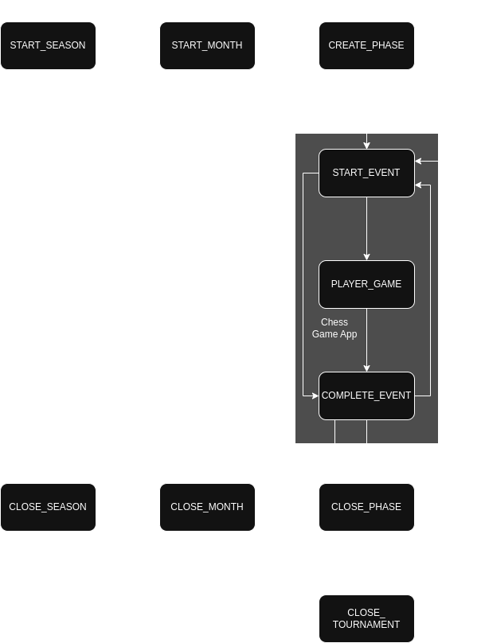

# Season Overview

This document provides details on the season lifecycle

---

## Season steps details

### CREATE_SEASON

<strong>details</strong>

**Processors:**

- `game_save_season` – creates a new season entity
- `game_save_ranking_season` – creates a ranking for the current season
- `season_tournament` – creates SeasonTournament entities with NOT_STARTED status
- `game_save_achievement_counter` – resets counters for season achievements
- `game_save_step` – creates steps for CLOSE_SEASON, START_MONTH, CLOSE_MONTH, CREATE_PHASES, CLOSE_TOURNAMENT

**Possible steps:**

- CREATE_PHASES

---

### CREATE_PHASES

 

<strong>details</strong>

**Processors:**

- `season_tournament_phase` – creates SeasonTournamentPhases with NOT_STARTED status
- `season_phase_group` – creates SeasonPhaseGroup for possible groups in step, should be created for all phases in
  season, since no players are needed to known at this moment
- `season_group_player` – creates pre-season SeasonGroupPlayer for possible:
    - League - full
    - Swiss National and Swiss Random - full
    - Cups - only first phase
    - Challenges - only first phase
- `game` – creates Game entities with NOT_STARTED status
    - full for: League, Swiss National and Swiss Random
    - only first phase for: Cups, Challenges tournaments
- `game_save_step` – creates steps for CLOSE_PHASES, UPDATE_PHASE and possible steps for START_EVENT_ PLAYER_GAME,
  COMPLETE_EVENT

**Possible steps:**

- START_MONTH

---

### START_MONTH

<strong>details</strong>

**Processors:**

- `season_tournament` – update tournament statues to IN_PROGRESS that starts in current month
- `season_tournament_phase` – update phases statues to IN_PROGRESS that starts in current month
- `season_phase_groups` - update groups statues to IN_PROGRESS that starts in current month
- `season_group_player` – create when players are known
    - MARCH, JUNE, AUGUST - swiss continental group players
    - JULY, OCTOBER, DECEMBER - swiss world group players
    - AUGUST - Cup of Nations first phase group players
    - OCTOBER - Derby first phase group players
    - DECEMBER - MASTERS first phase group players
- `game` – create games for season_group_player, create for SeasonGroupPlayers created in previous step
- `game_save_step` – creates possible steps for START_EVENT_ PLAYER_GAME, COMPLETE_EVENT

**Possible steps:**

- START_EVENT

---

### UPDATE_PHASE

(used for the next phase, not first starting in month)

<strong>details</strong>

**Processors:**

- `season_tournament_phase` – update with status IN_PROGRESS
- `season_phase_group` – update with status IN_PROGRESS
- `season_group_player` – create when players are known:
    - create knockout pairs for the next Derby or Winning Challenge phase
    - create from group-to-knockout pairs for World and Continental Cups
    - create progressive groups for the Cup of Nations
    - create shuffled next phase groups for the Fourth Challenge
- `game` – create Games for SeasonGroupPlayers created in a previous step
- `game_save_step` – creates possible steps for START_EVENT_ PLAYER_GAME, COMPLETE_EVENT

**Possible steps:**

- START_EVENT, CLOSE_MONTH

---

### START_EVENT

<strong>details</strong>

Step only to detect if there is a game save owner game or just redirect to COMPLETE_EVENT

**Possible steps:**

- PLAYER_GAME, COMPLETE_EVENT

---

### PLAYER_GAME

<strong>details</strong>

Currently, this step is used only to mark a player's game and redirect to COMPLETE_EVENT
All content should be managed by Chess Game App

**Possible steps:**

- COMPLETE_EVENT

---

### COMPLETE_EVENT

<strong>details</strong>

**Processors:**

- `game_score` - build and save scores for valid pc vs. pc games
- `game` – update Game entities with FINISHED status
- `season_group_player` – update player standings based on `game` results
- `game_save_achievement` - update achievements 21-23, 25-27 and all from game app counters achievements managed
- `game_save_achievement_counter` - reset counters that are updated by chess-game-app

**Possible steps:**

- CLOSE_PHASE, CLOSE_MONTH, START_EVENT

---

### CLOSE_PHASE

<strong>details</strong>

**Processors:**

- `season_phase_groups` - update phases statues to FINISHED that starts in current month
- `season_tournament_phase` – update SeasonTournamentPhase with FINISHED status

**Possible steps:**

- START_EVENT, UPDATE_PHASE, CLOSE_TOURNAMENT

---

### CLOSE_TOURNAMENT

<strong>details</strong>

**Processors:**

- `game` – update not finished games with CLOSED status
- `season_phase_group` – update not finished items with CLOSED status
- `season_tournament_phase` – update not finished items with CLOSED status
- `season_tournament` – update current SeasonTournament with FINISHED status
- `game_save_trophy` - upset player trophy data for tournament
- `game_save_medal` - save medals for tournament
- `game_save_chess_title` - save medals for tournament
- `game_save_achievement` - update GameSaveAchievement items 1, 31-40

**Possible steps:**

- CLOSE_MONTH, START_EVENT

---

### CLOSE_MONTH

<strong>CLOSE_MONTH</strong>

**Processors:**

- `game_save_ranking_global` - update global ranking
- `game_save_ranking_history` - add history ranking for player
- `game_save_ranking_season` - update season ranking
- `game_save_award` - update season awards
- `game_save_achievement_counter` - update MVP counter (achievementId is 56)
- `game_save_achievement` - update achievements: 8, 11 to 20, 81 to 85, 87 to 90

**Possible steps:**

- START_MONTH, CLOSE_SEASON

---

### CLOSE_SEASON

<strong>details</strong>

**Processors:**

- `game` - close unfinished Season Games
- `season_phase_group` - close unfinished Season Phase Groups
- `season_tournament_phase` - close unfinished Season Tournament Phases
- `season_tournament` - close unfinished Season Tournaments
- `game_save_season` - close current gameSaveSeason
- `game_save_chess_title` - adds season chess titles
- `season_ranking` - close unfinished Season Rankings
- `game_save_achievement` - update season gameSaveAchievement items

**Handlers:**

- `game_save_step` – 🟨 TODO should always set to CREATE_SEASON

**Possible steps:**

- CREATE_SEASON

---

---

## Event ordering system

GameSaveStep order is represented by a long value from - {date} + {priority} + {order}

date: yyyy-mm-dd (event date)
priority: xxx—lower values are executed first (value from table)
order: step (lower should be executed first, used i. ex. for separate event steps executed on the same day as in
Continental Cups)

Step table:

| priority | step             | built in steps                           | produces steps                                                          |
|----------|------------------|------------------------------------------|-------------------------------------------------------------------------|
| 100      | CREATE_SEASON    | CLOSE_SEASON                             | CLOSE_SEASON, START_MONTH, CLOSE_MONTH, CREATE_PHASES, CLOSE_TOURNAMENT |
| 200      | CREATE_PHASES    | CREATE_SEASON                            | CLOSE_PHASES, UPDATE_PHASES, START_EVENT_ PLAYER_GAME, COMPLETE_EVENT   |
| 250      | START_MONTH      | CREATE_SEASON                            | START_EVENT_ PLAYER_GAME, COMPLETE_EVENT                                |
| 300      | UPDATE_PHASE     | CREATE_PHASES                            | START_EVENT_ PLAYER_GAME, COMPLETE_EVENT                                |
| 400      | START_EVENT      | CREATE_PHASES, START_MONTH, UPDATE_PHASE |                                                                         |
| 450      | PLAYER_GAME      | CREATE_PHASES, START_MONTH, UPDATE_PHASE |                                                                         |
| 500      | COMPLETE_EVENT   | CREATE_PHASES, START_MONTH, UPDATE_PHASE |                                                                         |
| 600      | CLOSE_PHASE      | CREATE_PHASES                            |                                                                         |
| 700      | CLOSE_TOURNAMENT | CREATE_SEASON                            |                                                                         |
| 800      | CLOSE_MONTH      | CREATE_SEASON                            |                                                                         |
| 900      | CLOSE_SEASON     | CREATE_SEASON                            | CREATE_SEASON                                                           |

---

## Season lifecycle diagram

Last updated: 2025-09-14
