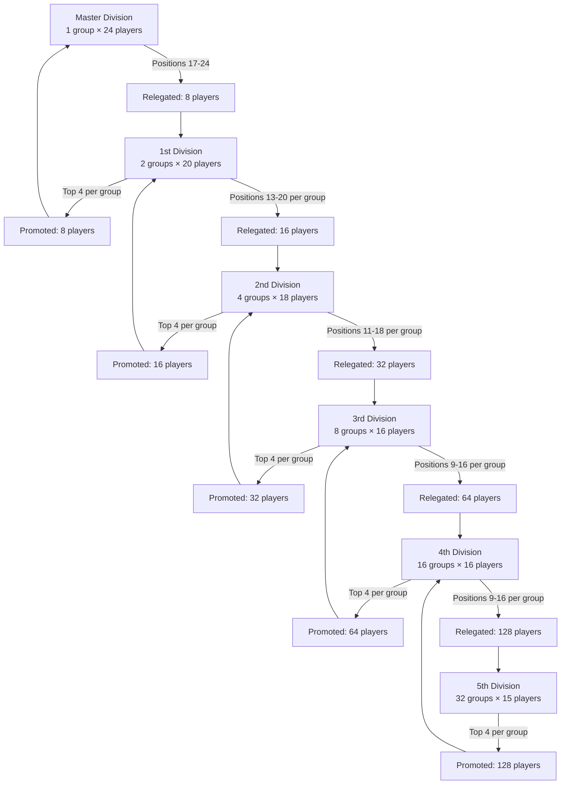
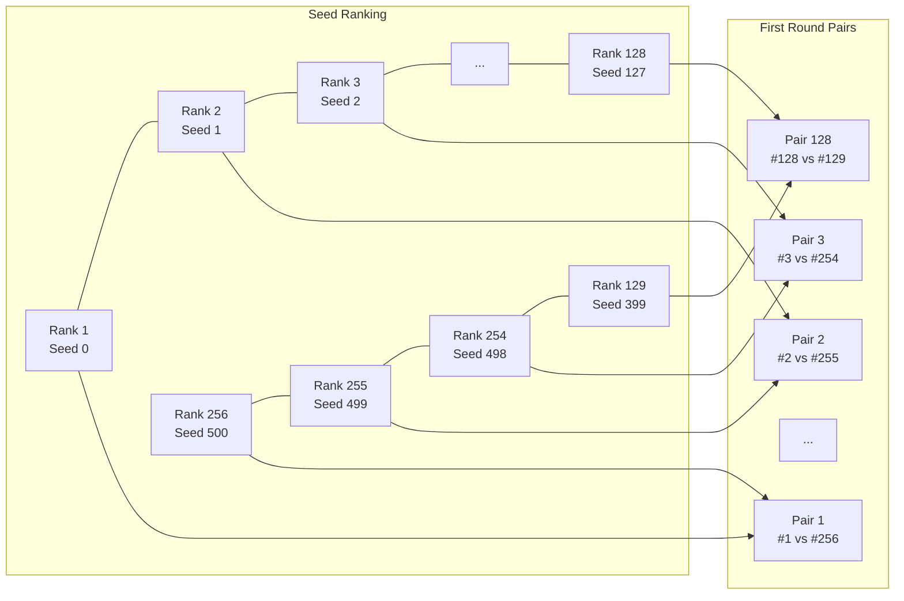

# Tournaments Overview

This document provides details on the various tournaments, including their format, schedule, structure, and participant
eligibility.

---

## 🎨 Tournament Color Key

| Color                                        | Tournament            | Abbr            | Type        |
|:---------------------------------------------|:----------------------|:----------------|:------------|
| 🔵 Blue   | League                | M/1/2/3/4/5-Div | Group       |
| 🟤 Brown  | Derby                 | D               | KO          |
| 🟣 Purple | Swiss National        | SN              | Swiss       |
| 🟣 Purple | Swiss Continental     | SC              | Swiss       |
| 🟣 Purple | Swiss World           | SW              | Swiss       |
| 🟣 Purple | Swiss Random          | SR              | Swiss       |
| 🟢 Green  | World/Continental Cup | WC/CC           | Hybrid      |
| 🔴 Red    | Fourth Challenge      | 4S              | Group       |
| 🔴 Red    | Winning Challenge     | WS              | KO          |
| 🟠 Orange | Cup of Nations        | CN              | Progressive |
| 🟡 Yellow | Masters               | M               | Group       |

## 🏆 Tournament Comparison Overview

This table provides a quick comparison of all tournaments based on their type, structure, and game timing.

| Tournament            | Type                | Phases               | Game Time | Move Addon |
|:----------------------|:--------------------|:---------------------|:----------|:-----------|
| **League**            | Group               | 6                    | 40 min    | +30 sec    |
| **Derby**             | Knock-Out           | 8                    | 10 min    | +5 sec     |
| **World Cup**         | Hybrid (Group → KO) | 6                    | 60 min    | +1 min     |
| **Continental Cup**   | Hybrid (Group → KO) | 5 for each continent | 60 min    | +1 min     |
| **Swiss National**    | Swiss-System        | 3                    | 5 min     | +3 sec     |
| **Swiss Continental** | Swiss-System        | 3                    | 5 min     | +3 sec     |
| **Swiss World**       | Swiss-System        | 3                    | 5 min     | +3 sec     |
| **Swiss Random**      | Swiss-System        | 3                    | 5 min     | +3 sec     |
| **Winning Challenge** | Knock-Out           | 9                    | 20 min    | +10 sec    |
| **Fourth Challenge**  | Group               | 4                    | 20 min    | +10 sec    |
| **Cup of Nations**    | Progressive Groups  | 5                    | 10 min    | +0 sec     |
| **Masters**           | Group               | 1                    | 20 min    | +10 sec    |

---

# 🗓️ Annual Tournament Calendar

# 📊 Calendar Overview

The calendar is divided into 4 weeks,
for weekly tournaments such as the **League**, **Derby** week must be counted from the first Friday of the month to
prevent that 4 weeks are not presents.

| Month     | Week   | Mon                                                             | Tue                                                             | Wed                                                                      | Thu                                                             | Fri                                                             | Sat                                                             | Sun                                                             |
|:----------|:-------|:----------------------------------------------------------------|:----------------------------------------------------------------|:-------------------------------------------------------------------------|:----------------------------------------------------------------|:----------------------------------------------------------------|:----------------------------------------------------------------|:----------------------------------------------------------------|
| January   | Week 1 | Swiss National #1            |                                                                 |                                                                          |                                                                 |                                                                 | League, Master, #1           |                                                                 |
| January   | Week 2 |                                                                 |                                                                 |                                                                          |                                                                 |                                                                 | League, Master, #2           |                                                                 |
| January   | Week 3 |                                                                 |                                                                 |                                                                          |                                                                 |                                                                 | League, Master, #3           |                                                                 |
| January   | Week 4 |                                                                 |                                                                 |                                                                          |                                                                 |                                                                 |                                                                 |                                                                 |
| February  | Week 1 | Swiss National #2            |                                                                 |                                                                          |                                                                 | League, Div 3-5, #1          | League, Master, #4           | League, Div 1-2, #1          |
| February  | Week 2 |                                                                 |                                                                 |                                                                          |                                                                 | League, Div 3-5, #2          | League, Master, #5           | League, Div 1-2, #2          |
| February  | Week 3 |                                                                 |                                                                 |                                                                          |                                                                 | League, Div 3-5, #3          | League, Master, #6           | League, Div 1-2, #3          |
| February  | Week 4 |                                                                 |                                                                 |                                                                          |                                                                 |                                                                 |                                                                 | >                                                               |
| March     | Week 1 | Swiss Continental #1         |                                                                 | Fourth, R1, #1 / Challenge R1         |                                                                 | League, Div 3-5, #4          | League, Master, #7           | League, Div 1-2, #4          |
| March     | Week 2 |                                                                 |                                                                 | Fourth, R1, #2 / Challenge R2         |                                                                 | League, Div 3-5, #5          | League, Master, #8           | League, Div 1-2, #5          |
| March     | Week 3 |                                                                 |                                                                 | Fourth, R1, #3                               |                                                                 | League, Div 3-5, #6          | League, Master, #9           | League, Div 1-2, #6          |
| March     | Week 4 |                                                                 |                                                                 |                                                                          |                                                                 |                                                                 | League, Master, #10          | League, Div 1-2, #7          |
| April     | Week 1 | Swiss National #3            |                                                                 | Fourth, R2, #1 / Challenge R3         |                                                                 | League, Div 3-5, #7          | League, Master, #11          | League, Div 1-2, #8          |
| April     | Week 2 |                                                                 |                                                                 | Fourth, R2, #2 / Challenge R4         |                                                                 | League, Div 3-5, #8          | League, Master, #12          | League, Div 1-2, #9          |
| April     | Week 3 |                                                                 |                                                                 | Fourth, R2, #3                               |                                                                 | League, Div 3-5, #9          | League, Master, #13          | League, Div 1-2, #10         |
| April     | Week 4 |                                                                 |                                                                 |                                                                          |                                                                 |                                                                 | League, Master, #14          | League, Div 1-2, #11         |
| May       | Week 1 | Swiss Random #1              |                                                                 | Fourth, R3, #1 / Challenge R5         |                                                                 | League, Div 3-5, #10         | League, Master, #15          | League, Div 1, #12           |
| May       | Week 2 |                                                                 |                                                                 | Fourth, R3, #2 / Challenge R6         |                                                                 | League, Div 3-5, #11         | League, Master, #16          | League, Div 1 #13, Div 2 #12 |
| May       | Week 3 |                                                                 |                                                                 | Fourth, R3, #3                               |                                                                 | League, Div 3-5, #12         | League, Master, #17          | League, Div 1 #14, Div 2 #13 |
| May       | Week 4 |                                                                 |                                                                 |                                                                          |                                                                 |                                                                 |                                                                 |                                                                 |
| June      | Week 1 | Swiss Continental #2         |                                                                 |                                                                          |                                                                 |                                                                 |                                                                 |                                                                 |
| June      | Week 2 | World/Continental Groups, #1 | World/Continental Groups, #2 | World/Continental Groups, #3          | World/Continental Groups, #4 | World/Continental Groups, #5 | World/Continental Groups, #6 | World/Continental Groups, #7 |
| June      | Week 3 | World/Continental First K.0  | World Second K.0 (1/8)       | Continental Quarter                   | World Quarter                | World/Continental Semi       |                                                                 | World/Continental Finals     |
| June      | Week 4 |                                                                 |                                                                 |                                                                          |                                                                 |                                                                 |                                                                 |                                                                 |
| July      | Week 1 | Swiss World #1               |                                                                 | Fourth, Final, #1 / Challenge Quarter |                                                                 | League, Div 3-5, #13         | League, Master, #18          | League, Div 1 #15, Div 2 #14 |
| July      | Week 2 |                                                                 |                                                                 | Fourth, Final, #2 / Challenge Semi    |                                                                 | League, Div 3-5, #14         | League, Master, #19          | League, Div 1 #16            |
| July      | Week 3 |                                                                 |                                                                 | Fourth, Final, #3 / Challenge Final   |                                                                 | League, Div 3-4, #15         | League, Master, #20          | League, Div 1 #17, Div 2 #15 |
| July      | Week 4 |                                                                 |                                                                 |                                                                          |                                                                 |                                                                 |                                                                 |                                                                 |
| August    | Week 1 | Swiss Continental #3         | Nations Cup G1, #1           | Nations Cup G1, #2                    | Nations Cup G1, #3           | Nations Cup G2, #1           | Nations Cup G2, #2           | Nations Cup G2, #3           |
| August    | Week 2 | Nations Cup G3, #1           | Nations Cup G3, #2           | Nations Cup G3, #3                    | Nations Cup G3, #4           | Nations Cup G4, #1           | Nations Cup G4, #2           | Nations Cup G4, #3           |
| August    | Week 3 | Nations Cup G4, #4           | Nations Cup G4, #5           | Nations Cup G4, #6                    | Nations Cup G5, #1           | Nations Cup G5, #2           | Nations Cup G5, #3           | Nations Cup G5, #4           |
| August    | Week 4 | Nations Cup G5, #5           | Nations Cup G5, #6           | Nations Cup G5, #7                    | Nations Cup G5, #8           |                                                                 |                                                                 |                                                                 |
| September | Week 1 | Swiss Random #2              |                                                                 |                                                                          |                                                                 |                                                                 | League, Master, #21          | League, Div 1 #18, Div 2 #16 |
| September | Week 2 |                                                                 |                                                                 |                                                                          |                                                                 |                                                                 | League, Master, #22          | League, Div 1 #19, Div 2 #17 |
| September | Week 3 |                                                                 |                                                                 |                                                                          |                                                                 |                                                                 | League, Master, #23          |                                                                 |
| September | Week 4 |                                                                 |                                                                 |                                                                          |                                                                 |                                                                 |                                                                 |                                                                 |
| October   | Week 1 | Swiss World #2               |                                                                 |                                                                          |                                                                 | Derby, #1, Game 1            | Derby, #1, Game 2            | Derby, #1, Game 3            |
| October   | Week 2 |                                                                 |                                                                 |                                                                          |                                                                 | Derby, #2, Game 1            | Derby, #2, Game 2            | Derby, #2, Game 3            |
| October   | Week 3 |                                                                 |                                                                 |                                                                          |                                                                 | Derby, #3, Game 1            | Derby, #3, Game 2            | Derby, #3, Game 3            |
| October   | Week 4 |                                                                 |                                                                 |                                                                          |                                                                 | Derby, #4, Game 1            | Derby, #4, Game 2            | Derby, #4, Game 3            |
| November  | Week 1 | Swiss Random #3              |                                                                 |                                                                          |                                                                 | Derby, #5, Game 1            | Derby, #5, Game 2            | Derby, #5, Game 3            |
| November  | Week 2 |                                                                 |                                                                 |                                                                          |                                                                 | Derby, Quarter, Game 1       | Derby, Quarter, Game 2       | Derby, Quarter, Game 3       |
| November  | Week 3 |                                                                 |                                                                 |                                                                          |                                                                 | Derby, Semi, Game 1          | Derby, Semi, Game 2          | Derby, Semi, Game 3          |
| November  | Week 4 |                                                                 |                                                                 |                                                                          |                                                                 | Derby, Final, Game 1         | Derby, Final, Game 2         | Derby, Final, Game 3         |
| December  | Week 1 | Swiss World #3               |                                                                 |                                                                          |                                                                 |                                                                 |                                                                 |                                                                 |
| December  | Week 2 | MASTERS #1                   | MASTERS #2                   | MASTERS #3                            | MASTERS #4                   | MASTERS #5                   | MASTERS #6                   | MASTERS #7                   |
| December  | Week 3 | MASTERS #8                   | MASTERS #9                   | MASTERS #10                           |                                                                 |                                                                 |                                                                 |                                                                 |
| December  | Week 4 |                                                                 |                                                                 |                                                                          |                                                                 |                                                                 |                                                                 |                                                                 |

# 📅 Tournament Schedule & Frequency

| Tournament            | Frequency             | Occurrence                         | Typical Days | Total Events/Yr        | Format & Notes                                               |
|:----------------------|:----------------------|:-----------------------------------|:-------------|:-----------------------|:-------------------------------------------------------------|
| **League (Master)**   | Yearly                | Weekly (Jan-Jul, Sep)              | Saturdays    | 23 games               | Group (Round-Robin)                                          |
| **League (Div 1-2)**  | Yearly                | Weekly (Feb-Jul, Sep)              | Sundays      | 19 (Div1), 17 (Div2)   | Group (Round-Robin)                                          |
| **League (Div 3-5)**  | Yearly                | Weekly (Feb-Jul)                   | Fridays      | 15 (Div3-4), 14 (Div5) | Group (Round-Robin)                                          |
| **Swiss National**    | Yearly                | Quarterly (1st Mon: Jan, Feb, Apr) | Monday       | 3 events               | Swiss-System                                                 |
| **Swiss Continental** | Yearly                | Quarterly (1st Mon: Mar, Jun, Aug) | Monday       | 3 events               | Swiss-System                                                 |
| **Swiss World**       | Yearly                | Quarterly (1st Mon: Jul, Oct, Dec) | Monday       | 3 events               | Swiss-System                                                 |
| **Swiss Random**      | Yearly                | Quarterly (1st Mon: May, Sep, Nov) | Monday       | 3 events               | Swiss-System                                                 |
| **Derby**             | Yearly                | Weekly (Oct-Nov)                   | Fri-Sun      | 8 rounds × 3 games     | Knock-Out (Best of 3)                                        |
| **World Cup**         | Biennial (Even Years) | Annual (June)                      | Mon-Sun      | two-weeks event        | Hybrid (Group then KO). **Alternates with Continental Cup.** |
| **Continental Cup**   | Biennial (Odd Years)  | Annual (June)                      | Mon-Sun      | two-weeks event        | Hybrid (Group then KO). **Alternates with World Cup.**       |
| **Fourth Challenge**  | Biennial (Even Years) | Monthly (Mar, Apr, May, Jul)       | Wednesdays   | 4 group stages         | Group (Round-Robin). **Alternates with Winning Challenge.**  |
| **Winning Challenge** | Biennial (Odd Years)  | Monthly (Mar-Jul)                  | Wednesdays   | 9 rounds               | Knock-Out (Best of 1). **Alternates with Fourth Challenge.** |
| **Cup of Nations**    | Yearly                | Annual (August)                    | Daily        | 19-day event           | Progressive Group Stage                                      |
| **Masters**           | Yearly                | Annual (December)                  | Daily        | Max 11 games           | Group (Round-Robin)                                          |

# 🎯 Tournament Eligibility & Player Selection Criteria

| Tournament            | Allowed Players & Qualification Criteria                                                                                                                                                                       | Total Players    | Selection Basis                        |
|:----------------------|:---------------------------------------------------------------------------------------------------------------------------------------------------------------------------------------------------------------|:-----------------|:---------------------------------------|
| **League**            | All players. **Group placement** depends on previous season's position (promotion/relegation system).                                                                                                          | Variable (All)   | Previous Season Performance            |
| **Derby**             | **Best players from current league group positions.** Eligibility depends on the tournament phase (round).                                                                                                     | 128 → 1          | Current League Position                |
| **World Cup**         | 1. Top 8 from previous World Cup 2. 2 finalists from previous Continental Cup (each of 7 continents) 3. Next 6 best World Ranking players from each continent                                            | 64               | Past Performance & Global Ranking      |
| **Continental Cup**   | 1. 4 semi-finalists from previous Continental Cup 2. Next 28 best-ranked players from the target continent                                                                                                  | 32 per continent | Past Performance & Continental Ranking |
| **Swiss National**    | Players from nationality groups with **>11 players**. Smaller nationalities are grouped by region. (Group canceled if region has <11 players).                                                                 | Variable         | Nationality & Region                   |
| **Swiss Continental** | Players from Swiss National. **Promoted:** (Average players / Total groups) rounded up. **At least** the winner of each Swiss National group.                                                                  | Variable         | Performance in Swiss National          |
| **Swiss World**       | **Best players from Swiss Continental** (e.g., top 4 from each group).                                                                                                                                         | Variable         | Performance in Swiss Continental       |
| **Swiss Random**      | **All players** are randomly assigned to groups of optimal size (~20 players).                                                                                                                                 | Variable (All)   | Random                                 |
| **Winning Challenge** | **Top 512 players** from the previous season's ranking. Seeding: 1 vs 512, 2 vs 511, etc.                                                                                                                      | 512              | Previous Season Ranking                |
| **Fourth Challenge**  | **Top 256 players** from the previous season's ranking. **Seeding:** Group 1: 1, 129, 257, 385; Group 2: 2, 130, 258, 386; etc.                                                                             | 256              | Previous Season Ranking                |
| **Cup of Nations**    | **The best player** from each of the **top 64 nationalities** in the **current season ranking**.                                                                                                               | 64               | Current Nationality Ranking            |
| **Masters**           | **World Cup Season:** Finalists from League, Derby, World Cup, Challenge, Cup of Nations (max 10). **Continental Season:** Winners from League, Derby, Continental Cup, Challenge, Cup of Nations (max 11). | 10 or 11         | Performance in Major Tournaments       |

# 🏆 Detailed Tournament Overview

## 🔵 League
*   **Type:** **Group (Round-Robin)** - Each player plays every other player in their group once.
*   **Game Length:** **40 minutes + 30 seconds per move**
*   **Calendar:** Runs from **January to July and September**. Specific days per division:
    *   **Master Div:** Saturdays
    *   **Div 1 & 2:** Sundays
    *   **Div 3, 4 & 5:** Fridays
*   **Phases & Groups:** The league is split into **6 Phases** (Master Phase + Phases 1-5). The number of groups depends on the Phase.
*   **Player Selection:** **All players** are placed into divisions and groups based on their performance in the **previous season** using a promotion/relegation system.

### ⚽ League Promotion & Relegation System

#### 📊 League Structure Overview

| Phase | Division Name       | Groups Count | Group Size | Total Players |      Promoted       |              Relegated               | Rank Points Multiplier |
|:-----:|:--------------------|:------------:|:----------:|:-------------:|:-------------------:|:------------------------------------:|:----------------------:|
|   1   | **Master Division** |      1       |     24     |      24       |          -          |  **Positions 17-24** (8 players)  |          1.5×          |
|   2   | **1st Division**    |      2       |     20     |      40       | **Top 4 per group** | **Positions 13-20** (8 per group) |          1.4×          |
|   3   | **2nd Division**    |      4       |     18     |      72       | **Top 4 per group** | **Positions 11-18** (8 per group) |          1.3×          |
|   4   | **3rd Division**    |      8       |     16     |      128      | **Top 4 per group** | **Positions 9-16** (8 per group)  |          1.2×          |
|   5   | **4th Division**    |      16      |     16     |      256      | **Top 4 per group** | **Positions 9-16** (8 per group)  |          1.1×          |
|   6   | **5th Division**    |      32      |     15     |      480      | **Top 4 per group** |          **No relegation**           |          1.0×          |

#### 🔄 Promotion/Relegation Flow

---

## 🟤 Derby
*   **Type:** **Knock-Out (Best of 3)** - Single-elimination bracket where each round is a best-of-three match.
*   **Game Length:** **10 minutes + 5 seconds per move**
*   **Calendar:** **October to November**. One round per week, with matches played **Friday to Sunday**.
*   **Phases & Groups:** **8 knockout rounds** (128 -> 64 -> 32 -> 16 -> 8 -> QF -> SF -> Final). The number of groups equals the number of pairs for each round.
*   **Player Selection:** The **best players from the current league group positions**. Eligibility for each round depends on the player's ongoing league performance.

### ⚽ Derby Promotion & Relegation System

#### 📊 Derby Structure Overview

|  Division  | Groups Count | Group Size | Total Players | Promoted per Group | Total Promoted | Qualification Criteria   | % of Division Promoted |
|:----------:|:------------:|:----------:|:-------------:|:------------------:|:--------------:|:-------------------------|:----------------------:|
| **Master** |      1       |     24     |      24       |         16         |     **16**     | Top 16 players           |         66.7%          |
|  **1st**   |      2       |     20     |      40       |         10         |     **20**     | Top 10 players per group |         50.0%          |
|  **2nd**   |      4       |     18     |      72       |         9          |     **36**     | Top 9 players per group  |         50.0%          |
|  **3rd**   |      8       |     16     |      128      |         7          |     **56**     | Top 7 players per group  |         43.8%          |
|  **4th**   |      16      |     16     |      256      |         4          |     **64**     | Top 4 players per group  |         25.0%          |
|  **5th**   |      32      |     15     |      480      |         2          |     **64**     | Top 2 players per group  |         13.3%          |
| **Total**  |    **63**    |   **-**    |   **1000**    |       **-**        |    **256**     | **-**                    |       **25.8%**        |

#### 🎯 Seeding & Pairing Principles

1.  **Total Players:** 256
2.  **Pairing Method:** **Snake System** based on a calculated **Seed Score**
3.  **Goal:** The highest Seed Score (best player) plays the lowest Seed Score (lowest qualified player).

---

#### 📊 Seed Score Calculation

Each player receives a **Seed Score** based on their **Division** and their **Position** within their group. A **lower score is better**.

|  Division  | Base Score | Position Multiplier | Seed Score Formula |
|:----------:|:----------:|:-------------------:|:------------------:|
| **Master** |     0      |  + (Position - 1)   |  `0 + (Pos. - 1)`  |
|  **1st**   |    100     |  + (Position - 1)   | `100 + (Pos. - 1)` |
|  **2nd**   |    200     |  + (Position - 1)   | `200 + (Pos. - 1)` |
|  **3rd**   |    300     |  + (Position - 1)   | `300 + (Pos. - 1)` |
|  **4th**   |    400     |  + (Position - 1)   | `400 + (Pos. - 1)` |
|  **5th**   |    500     |  + (Position - 1)   | `500 + (Pos. - 1)` |

**Example:**
- Master Div, Position 1: `0 + (1-1) = 0` **(Best Seed)**
- 1st Div, Position 1: `100 + (1-1) = 100`
- 5th Div, Position 2: `500 + (2-1) = 501`
- 5th Div, Position 1: `500 + (1-1) = 500` **(Worst Seed of qualified players)**

---

## 🧮 Ranking and Pairing

1.  **Rank all 256 players** from lowest Seed Score to highest Seed Score (0 to 500).
2.  **Pair them using the Snake System:**
    - Rank 1 (Best) vs. Rank 256 (Worst)
    - Rank 2 vs. Rank 255
    - Rank 3 vs. Rank 254
    - ...
    - Rank 128 vs. Rank 129

---

## 🟢 World Cup (WC)
*   **Type:** **Hybrid (Group then Knock-Out)** - A group stage followed by a single-elimination knockout phase.
*   **Game Length:** **60 minutes + 1 minute per move**
*   **Calendar:** **June** (Biennial on Even Years). A **two-week event** spanning the second and third weeks.
*   **Phases & Groups:** **6 phases**. Starts with **8 groups of 8 players**. The top players advance to a **32-player knockout bracket** (Round of 32 -> 16 -> QF -> SF -> Final).
*   **Player Selection:**
    1.  Top 8 from the previous World Cup.
    2.  2 finalists from the previous Continental Cup for each of the 7 continents (14 players).
    3.  The next 6 best World Ranking players from each continent (42 players).

### 🏆 Tournament Structure Overview

- **Qualified Players:** 64
- **Group Stage:** 8 groups of 8 players (Round-robin, 7 matches per player)
- **Teams Advancing:** Top 4 players from each group (32 total)
- **Knockout Stage:** Single-elimination bracket

---

## 🟢 Continental Cup (CC)
*   **Type:** **Hybrid (Group then Knock-Out)** - A group stage followed by a single-elimination knockout phase.
*   **Game Length:** **60 minutes + 1 minute per move**
*   **Calendar:** **June** (Biennial on Odd Years). A **two-week event** spanning the second and third weeks.
*   **Phases & Groups:** **5 phases per continent**. Starts with **4 groups of 8 players**. The top players advance to a knockout bracket.
*   **Player Selection:**
    1.  4 semi-finalists from the previous Continental Cup.
    2.  The next 28 best-ranked players from the target continent.

---

## 🟣 Swiss National (SN)
*   **Type:** **Swiss-System** - Players are paired against others with a similar score in the tournament. Each player plays 10 games.
*   **Game Length:** **5 minutes + 3 seconds per move**
*   **Calendar:** **Quarterly** on the first Monday of **January, February, and April**. All games are played in one day.
*   **Phases & Groups:** **3 separate tournaments per year**. Groups are formed for each nationality with over 11 players. Smaller nationalities are grouped by region. (A group is canceled if a region has fewer than 11 players).
*   **Player Selection:** Players from **nationality groups with >11 players** or from merged regional groups.

---

## 🟣 Swiss Continental (SC)
*   **Type:** **Swiss-System** - Players are paired against others with a similar score. Each player plays 10 games.
*   **Game Length:** **5 minutes + 3 seconds per move**
*   **Calendar:** **Quarterly** on the first Monday of **March, June, and August**. All games are played in one day.
*   **Phases & Groups:** **3 separate tournaments per year**. Groups are formed based on nationality/region, similar to the Swiss National.
*   **Player Selection:** Players promoted from **Swiss National** tournaments. The number promoted is (average players per total groups) rounded up. **At least** the winner of each Swiss National group is promoted.

---

## 🟣 Swiss World (SW)
*   **Type:** **Swiss-System** - Players are paired against others with a similar score. Each player plays 10 games.
*   **Game Length:** **5 minutes + 3 seconds per move**
*   **Calendar:** **Quarterly** on the first Monday of **July, October, and December**. All games are played in one day.
*   **Phases & Groups:** **3 separate tournaments per year**. Features a **single group**.
*   **Player Selection:** The **best players from the Swiss Continental** tournaments (e.g., the top 4 from each group).

---

## 🟣 Swiss Random (SR)
*   **Type:** **Swiss-System** - Players are paired against others with a similar score. Each player plays 10 games.
*   **Game Length:** **5 minutes + 3 seconds per move**
*   **Calendar:** **Quarterly** on the first Monday of **May, September, and November**. All games are played in one day.
*   **Phases & Groups:** **3 separate tournaments per year**. All players are **randomly assigned** to groups of optimal size (~20 players).
*   **Player Selection:** **All players** are eligible and randomly assigned.

---

## 🔴 Winning Challenge (WS)
*   **Type:** **Knock-Out (Best of 1)** - Single-elimination bracket where each round is a single game.
*   **Game Length:** **20 minutes + 10 seconds per move**
*   **Calendar:** **March to July** (Biennial on Odd Years). One round every **Wednesday**.
*   **Phases & Groups:** **9 knockout rounds** (512 -> 256 -> 128 -> 64 -> 32 -> 16 -> QF -> SF -> Final). The number of groups equals the number of pairs.
*   **Player Selection:** The **top 512 players** from the **previous season's ranking**. Seeding is traditional (1 vs. 512, 2 vs. 511, etc.).

---

## 🔴 Fourth Challenge (4S)
*   **Type:** **Group (Round-Robin)** - Players play everyone in their group. Only the winner advances.
*   **Game Length:** **20 minutes + 10 seconds per move**
*   **Calendar:** **March, April, May, July** (Biennial on Even Years). Rounds are played on **Wednesdays**.
*   **Phases & Groups:** **4 group stages**. Starts with **64 groups of 4 players**. Winners are regrouped into **16 groups**, then **4 groups**, and finally a **final group**.
*   **Player Selection:** The **top 256 players** from the **previous season's ranking**. Seeding: Group 1: 1, 129, 257, 385; Group 2: 2, 130, 258, 386; etc.

---

## 🟠 Cup of Nations (CN)
*   **Type:** **Progressive Group Stage** - Groups are merged and expanded between phases, with cumulative points.
*   **Game Length:** **10 minutes per game** (no increment)
*   **Calendar:** **August**. A **19-day event** with games on all days.
*   **Phases & Groups:** **5 phases**.
    *   Phase 1: 16 groups of 4
    *   Phase 2: 8 groups of 6
    *   Phase 3: 4 groups of 8
    *   Phase 4: 2 groups of 12
    *   Phase 5: 1 group of 16
*   **Player Selection:** The **best player** from each of the **top 64 nationalities** in the **current season ranking**.

---

## 🟡 Masters
*   **Type:** **Group (Round-Robin)** - Each player plays every other player in a single group.
*   **Game Length:** **20 minutes + 10 seconds per move**
*   **Calendar:** **December** (second week). One game per day.
*   **Phases & Groups:** **Single phase** with a **single group**.
*   **Player Selection:**
    *   **World Cup Season:** Finalists from League, Derby, World Cup, Challenge, Cup of Nations (max 10 players).
    *   **Continental Season:** Winners from League, Derby, Continental Cup, Challenge, Cup of Nations (max 11 players).

