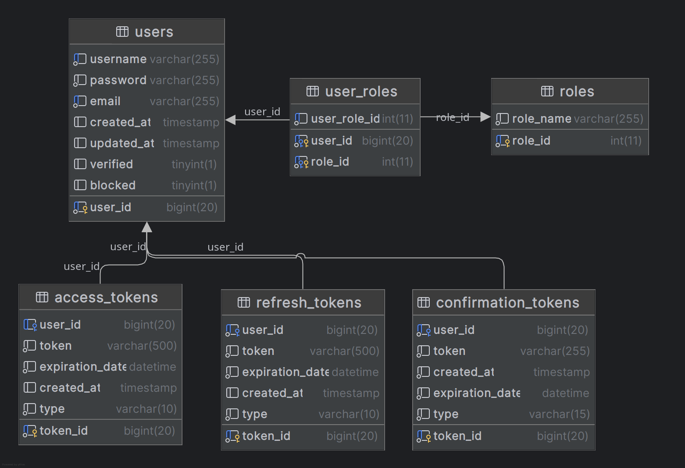

# Andromeda Schema

  

This repository contains the Andromeda project database schema and related materials.
Structure

    tables/ – Contains individual SQL files generated for each database table.

    model/ – Includes the latest full database schema exported from DataGrip. A preview of the current model is shown below.

    archive/ – Stores legacy and archived materials for reference.

    test_data/ – Stores sql files with insert queries used in test_andromeda database.

Current Model Preview

Andromeda Schema - 2025-04-05
