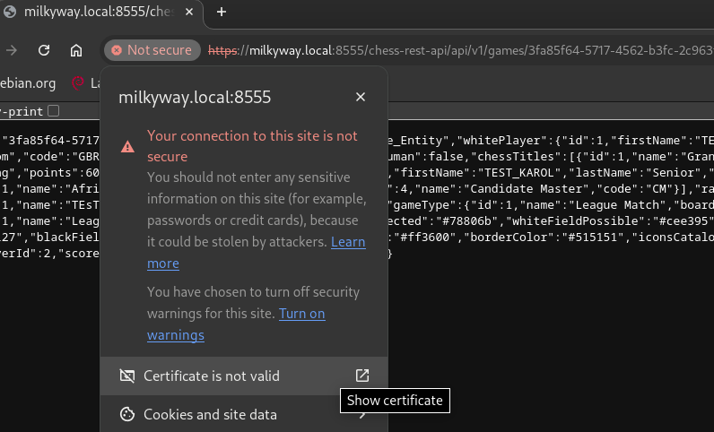
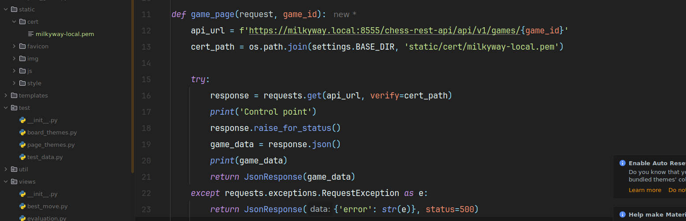
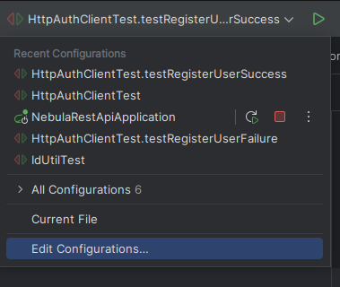
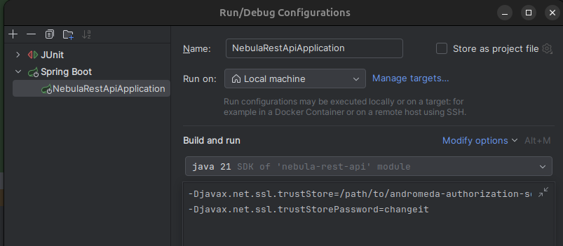
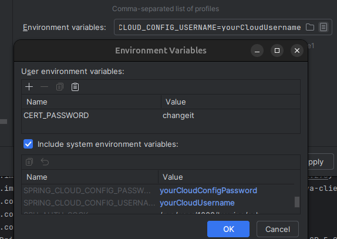

# Problem Solutions

## Problem with processing confirmation links

The issue occurred when trying to access the address example.local/nebula/app/confirm/{tokenId}/{token}, instead of
generating the address, a 404 message appeared.

The solution is to add the following lines to the file /etc/apache2/sites-enabled/000-default.conf:

```XML
<Directory "/var/www/html/nebula/app">
    RewriteEngine on
    # Don't rewrite files or directories
    RewriteCond %{REQUEST_FILENAME} -f [OR]
    RewriteCond %{REQUEST_FILENAME} -d
    RewriteRule ^ - [L]
    # Rewrite everything else to index.html to allow html5 state links
    RewriteRule ^ index.html [L]
</Directory>
```

## Downloading a self-signed certificate to the local environment

Allows solving the problem of testing a locally developed Django/Python application when encountering an SSLERror at
/endpoint_addres.


You need to download a certificate issued to the specific host. For example, using Chromium, click on “not secure” →
“Certificate is not valid”:


Then select “Export”:


And save the certificate to disk.

Optional installation of the certificate on the local machine, as admin:

```Bash
sudo cp /home/user/Downloads/andromeda-tomcat-certificate.crt /usr/local/share/ca-certificates/
sudo update-ca-certificates
```

Installation in the Django application:



## Setting up the Run Configuration in IntelliJ

Using the example of nebula-rest-api, to enable the application to run in IntelliJ Ultimate Edition, you need to edit
the application run configuration.



Then, add entries in the VM options to specify the location of the truststore.jks that contains the imported self-signed
certificate for the andromeda-auth-server:



For example:

```bash
-Djavax.net.ssl.trustStore=/path/to/andromeda-authorization-server/help/truststore.jks
-Djavax.net.ssl.trustStorePassword=changeit
```

'changeit' is the default password for the truststore, and it should be changed to your own.

Next, add environment variables:



This configuration should allow building and running the application in the local environment.
